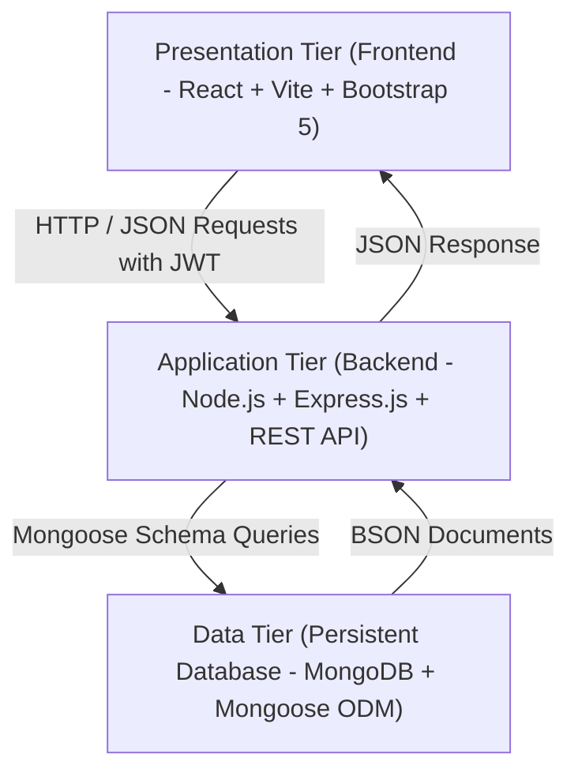

# 06. System Architecture

## Architecture Pattern
DevResource follows a clean **3-Tier MERN Architecture**:

## Layer Breakdown
1. **Presentation Layer (React Frontend)**:
   - Built with Vite for rapid bundling.
   - Modular components (`Navbar`, `Sidebar`, `Modal`, `MatchModal`, `Avatar`, `Badge`, `Toast`).
   - Global Contexts: `AuthContext` for credentials state; `ThemeContext` for CSS variables switching.
2. **Business Logic Layer (Express Backend)**:
   - RESTful routing (`/api/auth`, `/api/developers`, `/api/skills`, `/api/projects`, `/api/tasks`, `/api/matching`, `/api/dashboard`).
   - Middleware: `protect` (JWT validation), `adminOnly` (role enforcement), `errorHandler` (consistent error payloads).
   - Core Matching Engine: computes deterministic match percentages and suitability tiers.
3. **Data Layer (MongoDB)**:
   - Stores documents across `users`, `skills`, `projects`, `tasks`.
   - References via MongoDB `ObjectId` with automatic population.
