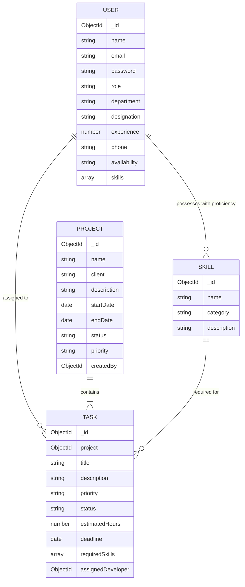

# 07. Database Design & Schemas

The system uses 4 core models in MongoDB:

## Schema Details

### 1. User Collection (`users`)
- `name` (String, required)
- `email` (String, required, unique, indexed)
- `password` (String, bcrypt hashed)
- `role` (Enum: `admin`, `developer`)
- `department` (String, default: `Engineering`)
- `designation` (String, default: `Software Engineer`)
- `experience` (Number, default: 1)
- `phone` (String)
- `availability` (Enum: `Available`, `Partially Allocated`, `Fully Allocated`)
- `skills`: Sub-document array `[{ skill: ObjectId (ref: Skill), proficiency: 'Beginner'|'Intermediate'|'Advanced'|'Expert' }]`

### 2. Skill Collection (`skills`)
- `name` (String, required, unique)
- `category` (String, default: `General`)
- `description` (String)

### 3. Project Collection (`projects`)
- `name` (String, required)
- `client` (String, default: `Internal`)
- `description` (String)
- `startDate` (Date)
- `endDate` (Date)
- `status` (Enum: `Planning`, `In Progress`, `Completed`, `On Hold`)
- `priority` (Enum: `Low`, `Medium`, `High`, `Urgent`)
- `createdBy` (ObjectId, ref: `User`)

### 4. Task Collection (`tasks`)
- `project` (ObjectId, ref: `Project`, required)
- `title` (String, required)
- `description` (String)
- `priority` (Enum: `Low`, `Medium`, `High`, `Urgent`)
- `status` (Enum: `To Do`, `In Progress`, `Completed`)
- `estimatedHours` (Number, default: 8)
- `deadline` (Date)
- `requiredSkills` (Array of ObjectId, ref: `Skill`)
- `assignedDeveloper` (ObjectId, ref: `User`, default: null)
